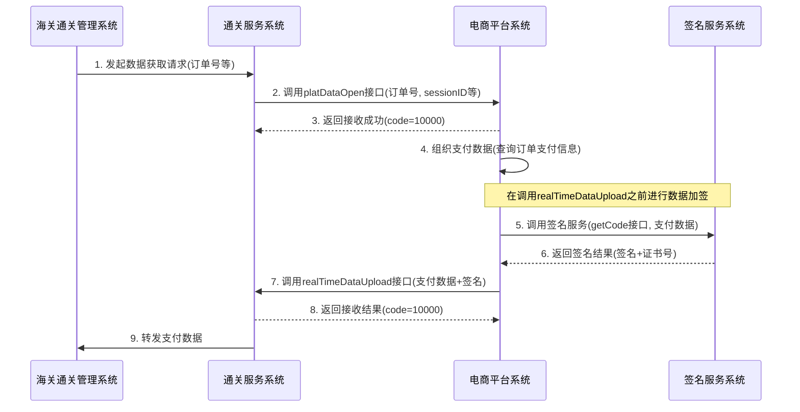

# Sign Server - 签名与 XML 文件管理服务

一个基于 Flask 的 Web 服务，提供两个核心功能：
1. **Sign64 签名服务**：基于 `Sign64.dll` 的 HTTP POST 接口，用于数据签名和证书号获取
2. **XML 文件管理服务**：基于 AES 加密的 XML 文件增删查接口

## 功能特性

### Sign64 签名服务
- 基于 `Sign64.dll` 的数据签名功能
- 获取证书号
- 与原始 ASP.NET WebService 功能一致
- 所有请求和响应使用 AES 加密传输

### XML 文件管理服务
- 所有业务接口入参为十六进制密文，请求端先加密再发送
- 解密后为 JSON，字段：`filename`、`xml`、可选 `directory`
- 若响应 `data` 为对象/数组，会再加密为十六进制密文返回
- 自动创建存储目录，支持指定自定义目录
- 完整的错误处理和日志记录

## 项目结构

```
sign-server/
├── app.py                  # Flask应用主文件（统一入口）
├── config.py               # 配置文件
├── sign64_wrapper.py       # Sign64.dll 的 Python 封装
├── aes_util.py             # AES加解密工具（Java兼容）
├── services/
│   └── xml_service.py      # XML文件业务逻辑（加/解密、校验、读写/删除）
├── getcode/
│   ├── bin/
│   │   ├── Sign64.dll       # 核心 DLL（必需）
│   │   └── ...              # 其他依赖 DLL
│   └── ...
├── xml_files/              # XML文件存储目录（自动创建）
├── test_sign64_http_service.py  # Sign64服务测试脚本
└── requirements.txt        # Python依赖
```

## 环境要求

- **操作系统**: Windows（Sign64.dll 只能在 Windows 上运行）
- **Python 版本**: Python 3.8+（推荐 3.12.2）
- **架构**: 64 位 Python（因为 DLL 是 64 位的）

## 安装 Python（Windows）

### 方式一：使用官方安装包（推荐）

1. 下载 Python 3.12.2：
   - 访问 https://www.python.org/downloads/release/python-3122/
   - 下载 "Windows installer (64-bit)"

2. 运行安装程序：
   - 双击下载的 `.exe` 文件
   - **重要**: 勾选 "Add Python to PATH"
   - 选择 "Install Now" 或 "Customize installation"
   - 完成安装

3. 验证安装：
   ```cmd
   python --version
   ```
   应该显示：`Python 3.12.2`

### 方式二：使用 winget（Windows 包管理器）

```cmd
winget install Python.Python.3.12.2
```

### 方式三：使用 Chocolatey

如果已安装 Chocolatey：

```cmd
choco install python312 --version=3.12.2
```

## 安装项目依赖

安装完 Python 后，安装项目依赖：

```bash
pip install -r requirements.txt
```

**如果遇到 `'pip' 不是内部或外部命令` 错误**：

### 解决方法1：使用 python -m pip

```bash
python -m pip install -r requirements.txt
```

### 解决方法2：检查 Python 是否安装

1. 检查 Python 是否安装：
   ```bash
   python --version
   ```
   如果显示版本号（如 `Python 3.12.2`），说明 Python 已安装。

2. 如果 Python 未安装，请先安装 Python：
   - 下载：https://www.python.org/downloads/
   - 安装时**务必勾选** "Add Python to PATH"

3. 如果 Python 已安装但 pip 不可用，尝试：
   ```bash
   python -m ensurepip --upgrade
   ```

**如果遇到网络超时或下载缓慢**，可以使用国内镜像源：

```bash
python -m pip install -r requirements.txt -i https://pypi.tuna.tsinghua.edu.cn/simple
```

## 配置说明

编辑 `config.py` 文件，配置以下参数：

```python
# AES解密密钥（必须与Java端使用的密钥一致）
AES_KEY = "1234567887654321"

# XML文件存储目录
SAVE_FOLDER = "./xml_files/"

# Flask服务配置
HOST = "0.0.0.0"  # 服务监听地址
PORT = 8801        # 服务端口号

# 日志级别
LOG_LEVEL = "INFO"
LOG_FORMAT = "%(asctime)s - %(name)s - %(levelname)s - %(message)s"
```

## 启动服务

```bash
python app.py
```

应用将在 `http://{HOST}:{PORT}` 启动（默认 `http://0.0.0.0:8801`）。

## 系统交互流程

以下序列图展示了签名服务在通关数据交互流程中的使用场景：



**说明**：
- 签名服务在电商平台系统调用 `realTimeDataUpload` 接口之前被调用
- 电商平台系统先组织好支付数据，然后调用签名服务对数据进行加签
- 签名服务返回签名结果和证书号后，电商平台系统将支付数据和签名一起发送给通关服务系统

## API 接口说明

### 加解密规则

所有 POST 接口的请求和响应都使用 AES 加密：
- **算法**: AES/ECB/PKCS5Padding
- **密钥**: 使用 `config.AES_KEY`
- **密文格式**: 十六进制字符串
- **字符编码**: UTF-8

### 1. GET / - 服务信息

获取服务信息和所有可用端点。

**响应：**
```json
{
    "service": "Sign Server",
    "version": "1.0.0",
    "status": "running",
    "endpoints": {
        "xml_files": {
            "list": {"method": "POST", "path": "/xml-files/list"},
            "add": {"method": "POST", "path": "/xml-files/add"},
            "delete": {"method": "POST", "path": "/xml-files/delete"}
        },
        "sign64": {
            "getCode": {"method": "POST", "path": "/getCode"}
        },
        "health": {"method": "GET", "path": "/health"}
    }
}
```

### 2. GET /health - 健康检查

健康检查接口。

**响应：**
```json
{
    "code": 200,
    "msg": "服务运行正常",
    "data": true,
    "sign64_status": "healthy"
}
```

### 3. POST /getCode - Sign64 签名接口

调用基于 `Sign64.dll` 的 `getCode` 方法，功能与原来的 ASP.NET Web Service 一致。

**请求体（密文）**：
解密后的 JSON 格式：
```json
{
    "str": "需要加签数据字符串",
    "pwdstr": "00000000"
}
```

**响应（密文）**：
解密后的 JSON 格式：
```json
{
    "code": 200,
    "msg": "成功",
    "data": {
        "getCodeResult": "签名字符串||证书号字符串"
    }
}
```

> **注意**: 实际请求和响应中的 `data` 字段是加密后的密文字符串。

返回结果用 `||` 分隔，第一部分是签名结果，第二部分是证书号。

### 4. POST /xml-files/add - 新增 XML 文件

新增或覆盖 XML 文件。

**请求体（密文）**：
解密后的 JSON 格式：
```json
{
    "filename": "example.xml",
    "xml": "<xml>...</xml>",
    "directory": "/path/optional"
}
```

**响应：**
```json
{
    "code": 200,
    "msg": "新增成功",
    "data": true
}
```

### 5. POST /xml-files/list - 查询 XML 文件列表

获取指定目录下的所有 XML 文件（文件名 + 内容）。

**请求体（密文）**：
解密后的 JSON 格式（可选 directory）：
```json
{
    "directory": "/path/optional"
}
```

**响应（密文）**：
解密后的 JSON 格式：
```json
{
    "code": 200,
    "msg": "查询成功",
    "data": [
        {"filename": "a.xml", "xml": "<xml>...</xml>"},
        {"filename": "b.xml", "xml": "<xml>...</xml>"}
    ]
}
```

> **注意**: 实际响应中的 `data` 字段是加密后的密文字符串。

### 6. POST /xml-files/delete - 删除 XML 文件

删除指定 XML 文件。

**请求体（密文）**：
解密后的 JSON 格式：
```json
{
    "filename": "example.xml",
    "directory": "/path/optional"
}
```

**响应：**
```json
{
    "code": 200,
    "msg": "删除成功",
    "data": true
}
```

## 使用示例

### Python 调用 Sign64 接口

```python
import requests
import json
from aes_util import mysql_adapter_encrypt, mysql_adapter_decrypt

# 配置
AES_KEY = "1234567887654321"
url = "http://localhost:8801/getCode"

# 准备请求数据
request_data = {
    "str": "test_data_string",
    "pwdstr": "00000000"
}

# 加密请求数据
plaintext = json.dumps(request_data, ensure_ascii=False)
cipher_text = mysql_adapter_encrypt(AES_KEY, plaintext, encoding="UTF-8")

# 发送请求
response = requests.post(url, data=cipher_text.encode('utf-8'))

# 解密响应
if response.status_code == 200:
    result = response.json()
    encrypted_data = result["data"]
    decrypted_data = mysql_adapter_decrypt(AES_KEY, encrypted_data, encoding="UTF-8")
    data_obj = json.loads(decrypted_data)
    
    # 获取结果
    getcode_result = data_obj["getCodeResult"]
    arr_result = getcode_result.split("||")
    sign_result = arr_result[0]  # 签名结果
    cert_no = arr_result[1]      # 证书号
    print(f"签名: {sign_result}")
    print(f"证书号: {cert_no}")
```

### Python 调用 XML 文件接口

```python
import requests
import json
from aes_util import mysql_adapter_encrypt, mysql_adapter_decrypt

# 配置
AES_KEY = "1234567887654321"
url = "http://localhost:8801/xml-files/add"

# 准备请求数据
request_data = {
    "filename": "example.xml",
    "xml": "<root><data>test</data></root>"
}

# 加密请求数据
plaintext = json.dumps(request_data, ensure_ascii=False)
cipher_text = mysql_adapter_encrypt(AES_KEY, plaintext, encoding="UTF-8")

# 发送请求
response = requests.post(url, data=cipher_text.encode('utf-8'))
print(response.json())
```

### 测试脚本

运行 Sign64 服务测试脚本：

```bash
python test_sign64_http_service.py
```

> **注意**: 运行测试前，请确保服务已启动（`python app.py`），并且测试脚本已更新为使用正确的端口（8801）和加密方式。

## AES 解密算法说明

本应用实现的 AES 加解密算法与 Java `AESUtil.mysqlAdapterDecrypt/mysqlAdapterEncrypt` 方法兼容：

1. **算法模式**: AES/ECB/PKCS5Padding
2. **密钥生成**: 使用 MySQL AES 密钥生成算法（16字节密钥，通过XOR循环生成）
3. **密文格式**: 十六进制字符串
4. **字符编码**: UTF-8

## 技术实现

### Sign64Wrapper

`sign64_wrapper.py` 提供了 `Sign64Wrapper` 类，封装了 `Sign64.dll` 的以下函数：

- `Sign(byte[] src, uint srcLen, byte[] sign1, uint[] signLen, char[] pwd)`：对数据进行签名
- `GetCertNo(byte[] szCertNo, uint[] nCertNoLen)`：获取证书号
- `GetCardID(byte[] szCardID, uint[] nCardIDLen)`：获取卡号（可选）

实现逻辑与反编译得到的 C# 代码一致：

```csharp
public string getCode(string str, string pwdstr)
{
    byte[] jjj = Encoding.UTF8.GetBytes(str);
    byte[] sign1 = new byte[172];
    uint[] signLen = new uint[1000];
    signLen[0] = 172u;
    uint Len = (uint)jjj.Length;
    char[] pwd = pwdstr.ToCharArray();
    uint res = Sign(jjj, Len, sign1, signLen, pwd);
    uint[] ii = new uint[8];
    byte[] jj = new byte[8];
    GetCertNo(jj, ii).ToString();
    return Encoding.UTF8.GetString(sign1) + "||" + Encoding.UTF8.GetString(jj);
}
```

## 错误处理

应用包含完整的错误处理机制：

- JSON 解析错误
- 字段验证错误
- AES 解密失败
- Sign64 DLL 加载失败
- Sign64 调用错误
- 文件写入失败
- 其他未知错误

所有错误都会记录到日志中，并返回相应的错误响应。

### 常见错误码

- **错误码 4294967294 (0xFFFFFFFE)**：通常表示 UKey 未连接、驱动未安装或需要初始化
- **其他非零错误码**：请参考 `Sign64.dll` 的官方文档

## 日志记录

应用使用 Python 标准 logging 模块记录日志，包括：

- 请求接收日志
- 解密过程日志（解密前后）
- 加密过程日志（加密前后）
- Sign64 调用日志
- 文件保存日志
- 错误日志

日志级别可通过 `config.py` 中的 `LOG_LEVEL` 配置。

## 常见问题

### 1. 'pip' 不是内部或外部命令

**原因**：Python 未添加到 PATH 环境变量，或 pip 未正确安装。

**解决方法**：
- **推荐**：使用 `python -m pip` 代替 `pip`
  ```bash
  python -m pip install -r requirements.txt
  ```
- 检查 Python 是否安装：`python --version`
- 如果 Python 未安装，重新安装并勾选 "Add Python to PATH"
- 如果 Python 已安装但 pip 不可用：`python -m ensurepip --upgrade`

### 2. DLL 加载失败

**原因**：DLL 文件路径不正确或缺少依赖。

**解决方法**：
- 确保 `Sign64.dll` 在 `getcode/bin/` 目录下
- 检查 DLL 的依赖项是否都已安装

### 3. Sign 调用返回错误码

**原因**：UKey 未连接、驱动未安装、需要初始化或参数不正确。

**解决方法**：
- 确保 UKey 已插入电脑
- 安装 UKey 厂商提供的驱动
- 检查设备管理器中的设备状态
- 确认 `pwdstr` 参数是否正确（可能需要真实的 UKey PIN）
- 查看 `Sign64.dll` 的官方文档了解错误码含义

### 4. AES 解密失败

**原因**：密钥不一致或密文格式错误。

**解决方法**：
- 确保 `config.AES_KEY` 与 Java 端使用的密钥一致
- 检查密文是否为十六进制字符串
- 确认加密算法为 AES/ECB/PKCS5Padding

## 注意事项

1. **平台要求**：
   - Windows DLL 只能在 Windows 平台上运行
   - 确保使用 64 位 Python（因为 DLL 是 64 位的）

2. **DLL 路径**：
   - DLL 文件应该在 `getcode/bin/` 目录下
   - `Sign64Wrapper` 会自动搜索 DLL 路径

3. **编码**：
   - 请求和响应都使用 UTF-8 编码
   - JSON 格式传输

4. **加密传输**：
   - 所有 POST 接口的请求和响应都使用 AES 加密
   - 确保 `AES_KEY` 配置与客户端一致

5. **UKey 相关**：
   - 确保 UKey 已正确插入并安装驱动
   - 某些操作可能需要管理员权限
   - 如果遇到错误码，请参考 `Sign64.dll` 的官方文档

6. **文件管理**：
   - 文件名会自动添加 `.xml` 扩展名（如果未提供）
   - 文件名中的路径分隔符会被自动清理，防止路径遍历攻击

## 许可证

本项目仅用于学习和参考目的。
